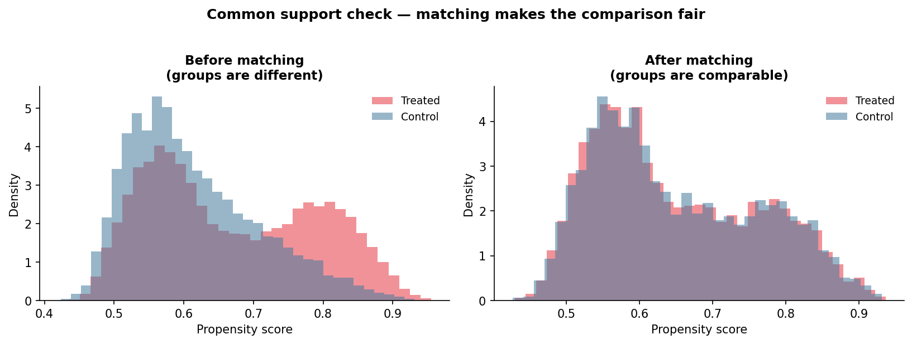
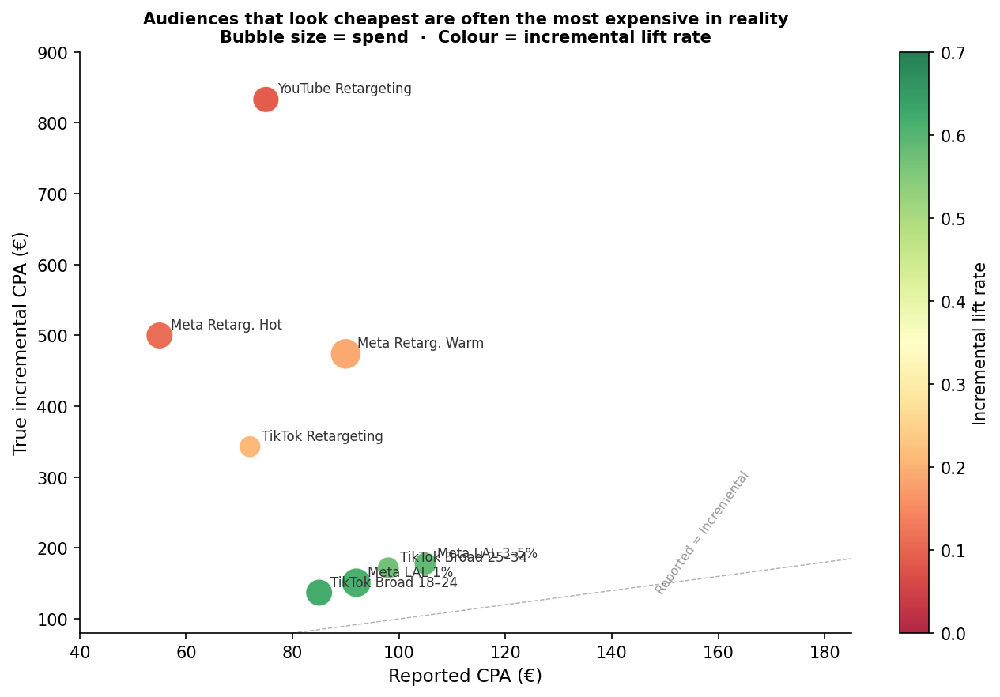
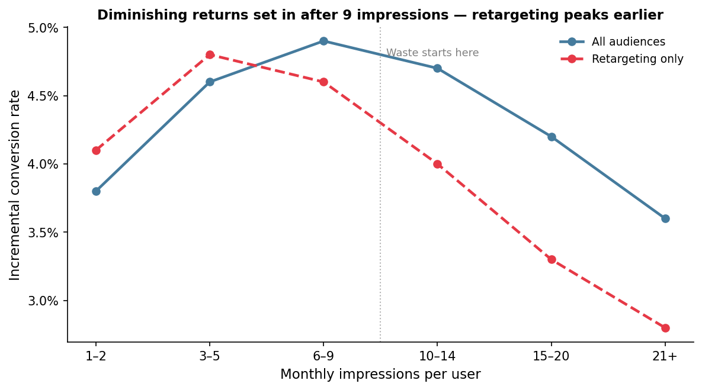
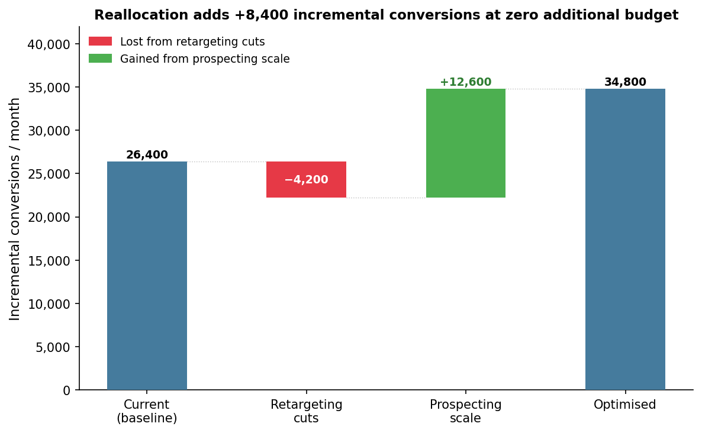

# Incrementality-Driven Audience Targeting for Paid Media

> **€6.5M/month - France - UK - Germany -- TikTok, Meta, YouTube · Q3 2025**

---

**Dashboards showed 3.0× ROAS. Real performance was 1.25×.**

Reported CPA: €106. True CPA: €246. The €140 gap is the cost of taking credit for purchases that would have happened anyway.

Propensity Score Matching was applied to 340K users to separate which audiences the ads actually drove and which ones would have converted anyway.

---

**Repo contents:**
- `README.md` — case study and business recommendations
- `sql/` — BigQuery queries for exploration, matching prep, and lift analysis
- `python/` — PSM pipeline and budget simulation
- `images/` — final charts
- `data/` — sample dataset used for analysis; full dataset can be regenerated via script

---

## Executive Summary

**The problem.** €2.9M/month is currently allocated to retargeting. Hot retargeting shows €55 CPA in the dashboard. The real cost, once you strip out users who were buying anyway, is €500.

**What that means.** 57% of attributed conversions aren't incremental. They're organic purchases that happened to touch an ad. That revenue would have happened regardless.

**What to change.** Move €1.3M from retargeting into TikTok and Meta prospecting. Cap retargeting at 9 impressions per user per month. That's it.

**What you'd get.** +8,400 incremental conversions per month. True CPA drops from €246 to €187. +€30.2M in actual new revenue per year. No budget increase.

---

## The Problem

Platform attribution gives credit to any ad the user saw in the 7 days before purchasing. That's not causation, that's just proximity.

Retargeting targets people who already abandoned a cart, already visited the site multiple times, already searched the brand. These users were going to buy. An ad was shown, they purchased, and the platform took credit.

This is selection bias at scale. The audiences with the highest CVR have the highest purchase intent regardless of any ad exposure. Reported metrics measure intent, not impact.

---

## Data

Three BigQuery tables, 340K users, Q3 2025.

| Table | Key fields |
|-------|-----------|
| `media.impressions` | `user_id`, `channel`, `audience_type`, `impression_ts`, `spend_eur`, `frequency` |
| `events.conversions` | `user_id`, `conversion_ts`, `revenue_eur`, `is_first_purchase` |
| `crm.user_features` | `n_prior_purchases`, `n_organic_sessions_30d`, `days_since_last_visit`, `loyalty_tier`, `age_group` |

**Treatment:** saw at least one paid impression in a 30-day window.  
**Control:** visited the site but saw zero paid ads in the same window.  
**Outcome:** purchased within 7 days.

---

## Measurement Approach

The core problem: people who saw ads are not a random sample. Platforms deliberately serve impressions to users most likely to buy. So if you compare "people who saw ads" vs. "people who didn't", you're not measuring the ad effect — you're measuring the fact that platforms targeted high-intent users.

Propensity Score Matching addresses this directly. For each exposed user, the model finds an unexposed user who looked identical before the campaign: same purchase history, same visit frequency, same loyalty status. Comparing what each pair did isolates the causal ad effect.

**Variables used for matching (all measured before any ad exposure):**  
`n_prior_purchases` · `days_since_last_visit` · `n_organic_sessions_30d` · `loyalty_tier` · `email_subscriber` · `age_group` · `device_type` · `country`

**Setup:** 1:1 nearest-neighbour matching, caliper = 0.01, matched within country × channel. After matching, the two groups are statistically indistinguishable on all covariates (SMD < 0.1 across the board).

**→ Chart 1 — Propensity score distribution, before and after matching.**  
Two histograms side by side. Before matching: the treated group skews heavily toward high propensity scores. they were targeted because they were high-intent. After matching: the distributions overlap almost perfectly. That overlap is what makes the comparison valid.



---

## What We Found

### The rankings flip entirely

| Audience | Spend | Reported CPA | Lift Rate | True Inc. CPA | Call |
|----------|-------|-------------|-----------|---------------|------|
| TikTok Broad 18–24 | €683K | €85 | 62% | **€137** | Scale |
| Meta LAL 1% | €813K | €92 | 61% | **€151** | Scale |
| Meta LAL 3–5% | €488K | €105 | 59% | **€178** | Scale |
| TikTok Broad 25–34 | €455K | €98 | 57% | **€172** | Scale |
| TikTok Retargeting | €455K | €72 | 21% | €343 | Cut |
| Meta Retargeting Warm | €878K | €90 | 19% | €474 | Cut |
| Meta Retargeting Hot | €683K | €55 | 11% | €500 | Cut |
| YouTube Retargeting | €650K | €75 | 9% | **€833** | Cut |

The audiences that look cheapest in the dashboard are the most expensive once measured correctly. The ones that look expensive are doing real work.

**→ Chart 2 — Reported CPA vs Incremental CPA, bubble chart.**  
X-axis: reported CPA. Y-axis: true incremental CPA. Bubble size: spend. Colour: lift rate — red for low, green for high. Retargeting sits bottom-left (cheap reported CPA) and top-right (expensive true CPA). Prospecting is the opposite. Show this chart first in any leadership meeting.



### The aggregate gap

| | Reported | Incremental |
|-|----------|-------------|
| Monthly conversions | 61,425 | 26,400 |
| CPA | €106 | €246 |
| ROAS | 2.9× | 1.25× |

61,425 conversions were reported. 26,400 were real. The other 35,000 would have happened without any ad spend.

---

## Frequency: burning money past 9 impressions

| Frequency band | Incremental CVR | Change vs. baseline |
|----------------|----------------|---------------------|
| 1–2 | 3.8% | — |
| 3–5 | 4.6% | +21% |
| **6–9** | **4.9%** | **+29% — peak** |
| 10–14 | 4.7% | +24% |
| 15–20 | 4.2% | +11% |
| 21+ | 3.6% | −5% |

Ads start losing effectiveness after 9 impressions. After 20, they actively hurt; users convert below their organic baseline. Some TikTok line items ran with no frequency cap. Meta retargeting hit 60+ impressions per month for certain users. That spend is not neutral; it's counterproductive.

**→ Chart 3 — Incremental CVR by frequency band.**  
Line chart with two series: all audiences combined, and retargeting only. Retargeting peaks earlier and drops off harder. Add a dashed vertical line at frequency 9 labelled "waste starts here."



---

## Key Insights

**1. Hot retargeting costs €500 per incremental conversion, not €55.**  
The €55 CPA is real — the conversions happen. But 89% of those users were going to buy regardless. The spend covered witnessing purchases, not causing them.

**2. TikTok 18–24 is a better investment than Meta hot retargeting when measured incrementally. The reported metrics show it backwards.**  
TikTok 18–24 true CPA: €137. Meta hot retargeting true CPA: €500. The audience that looks more expensive in the dashboard is the one actually driving new demand.

**3. YouTube retargeting has a 9% lift rate. That's €650K/month for limited incremental value.**  
91% of conversions from that audience were going to happen anyway. YouTube does work, but only for prospecting. YouTube brand safety audiences showed 56% lift. Same platform, completely different result.

**4. UGC creative outperforms branded studio content by 17 percentage points on incremental lift.**  
This isn't about cost. UGC reaches people who don't already know the brand. Lower baseline intent means more room for the ad to change behaviour. Branded content performs better on audiences that are already warm — which means it's less likely to be the reason they convert.

**5. Germany's budget is allocated backwards.**  
Germany has 42% of its spend in retargeting — the highest of the three markets — despite having the lowest brand awareness and the most to gain from prospecting. The market with the highest incremental opportunity is the one being spent defensively.

---

## Budget Reallocation

Move €1.3M from retargeting to prospecting. Add frequency caps. Total spend stays the same.

| | Current | Optimised | Change |
|-|---------|-----------|--------|
| Prospecting spend | €3.575M | €4.875M | +€1.3M |
| Retargeting spend | €2.925M | €1.625M | −€1.3M |
| Incremental conv/month | 26,400 | 34,800 | **+32%** |
| True CPA | €246 | €187 | **−24%** |
| Annual incremental revenue | — | **+€30.2M** | — |

**→ Chart 4 — Waterfall: incremental conversion bridge.**  
Start at 26,400. Remove conversions lost from retargeting cuts (−4,200). Add conversions gained from prospecting scale (+12,600). End at 34,800. Red bars for cuts, green for gains.



One thing to flag upfront: reported CPA will go up after this change. Prospecting always looks worse than retargeting in platform dashboards because it reaches people who weren't already about to convert. If the team optimises back toward reported CPA, the budget drifts back to retargeting within 6 weeks and the analysis is wasted. Changing the budget without changing the KPIs doesn't work.

---

## Recommendations

| # | Action | When | Impact |
|---|--------|------|--------|
| 1 | Pause YouTube retargeting. Redirect €650K to YouTube brand safety prospecting. | Now | Swap 9% lift for 56% |
| 2 | Cap all retargeting at 9 impressions per user per month. | Now | ~€380K/month recovered |
| 3 | Shift €1.3M from retargeting to TikTok and Meta LAL prospecting. | 30 days | +8,400 incremental conv/month |
| 4 | Make UGC the default creative for prospecting. 60% of creative budget goes to creators. | 30 days | +17pp lift rate |
| 5 | Replace reported CPA with incremental CPA as the primary media KPI. | 90 days | Fixes the root cause |

---

## Running This Ongoing

**Automate monthly.** The PSM pipeline runs in Airflow — pull updated CRM features from the CDP, re-run matching, write lift metrics back to BigQuery. It takes about 45 minutes. The output feeds directly into the media planning tool so buyers see incremental CPA next to reported CPA before setting budgets.

**Validate with experiments.** Every quarter, hold out 10% of users in France from paid media. Compare their conversion rate to the matched control group. If the two estimates are within 5 percentage points, the model is calibrated. If they diverge, retrain — it means user behaviour or platform targeting has shifted.

**Keep it visible.** Incrementality analysis only changes decisions if the numbers are in the room. Build a dashboard that leadership sees alongside the standard media report. If incremental CPA is buried in a separate doc, it will be ignored.

---

## How to Reproduce

Run from the project root.

```bash
pip install -r requirements.txt
python python/generate_data.py    # → data/synthetic_data.csv
python python/generate_charts.py  # → images/chart_*.png
```
A sample dataset is included. Full dataset can be regenerated via script.

`generate_data.py` creates a 20K-user synthetic dataset with the schema described above.  
`generate_charts.py` runs propensity matching on that data (Chart 1) and renders all four charts.

---


## Code

Full SQL and Python in [`sql/`](./sql/) and [`python/`](./python/).

**First thing to run — check baseline intent by audience:**

```sql
-- Before any modelling, look at who's in each audience.
-- If retargeting users have high prior purchases and organic sessions,
-- they were already going to buy. That's your selection bias, right there.
SELECT
    audience_type,
    AVG(f.n_prior_purchases)          AS avg_prior_purchases,
    AVG(f.n_organic_sessions_30d)     AS avg_organic_sessions,
    AVG(p.converted)                  AS reported_cvr
FROM `prod.analysis.psm_dataset` p
JOIN `prod.crm.user_features` f USING (user_id)
WHERE treatment = 1
GROUP BY 1
ORDER BY avg_prior_purchases DESC;
-- Expected result: retargeting_hot sits at the top on every column.
-- High CVR, high prior purchases, high organic sessions.
-- That's not a good audience — it's a biased one.
```

**The core output — lift by segment:**

```sql
-- After matching, this is the number that matters.
-- incremental_cpa is what you're actually paying per conversion caused by the ad.
-- Compare it to reported CPA and you'll see where the waste is.
SELECT
    channel,
    audience_type,
    country,
    AVG(treated_converted)                               AS treated_cvr,
    AVG(control_converted)                               AS control_cvr,
    AVG(treated_converted - control_converted)           AS incremental_cvr,
    SAFE_DIVIDE(
        AVG(treated_converted - control_converted),
        AVG(treated_converted)
    )                                                    AS lift_rate,
    SAFE_DIVIDE(
        SUM(spend_eur),
        SUM(treated_converted - control_converted)
    )                                                    AS incremental_cpa
FROM `prod.analysis.matched_pairs`
GROUP BY 1, 2, 3
ORDER BY lift_rate DESC;
```

**PSM matching — the core logic:**

```python
import numpy as np
import pandas as pd
from sklearn.linear_model import LogisticRegression

FEATURES = [
    "n_prior_purchases", "n_organic_sessions_30d", "days_since_last_visit",
    "email_subscriber", "age_group_enc", "device_type_enc", "loyalty_tier_enc",
]

def estimate_propensity(df: pd.DataFrame) -> pd.DataFrame:
    # Fit a logistic regression to predict who gets targeted.
    # The predicted probability is the propensity score.
    model = LogisticRegression(max_iter=500, C=1.0)
    model.fit(df[FEATURES], df["treatment"])
    ps = model.predict_proba(df[FEATURES])[:, 1]
    df["ps"] = np.clip(ps, 1e-6, 1 - 1e-6)
    df["logit_ps"] = np.log(df["ps"] / (1 - df["ps"]))
    return df

def match(df: pd.DataFrame, caliper: float = 0.01) -> pd.DataFrame:
    # For each exposed user, find the closest unexposed user by propensity score.
    # Match within country × channel — don't compare across markets.
    # caliper = 0.01 means only accept matches within 0.01 on the logit scale.
    pairs = []
    for _, group in df.groupby(["country", "channel", "audience_type"]):
        treated = group[group["treatment"] == 1]
        control = group[group["treatment"] == 0]
        used = set()
        for i, t_row in treated.iterrows():
            dists = (control["logit_ps"] - t_row["logit_ps"]).abs()
            dists[control.index.isin(used)] = np.inf
            j = dists.idxmin()
            if dists[j] <= caliper:
                pairs.append({
                    "treated_idx":   i,
                    "control_idx":   j,
                    "channel":       t_row["channel"],
                    "audience_type": t_row["audience_type"],
                    "country":       t_row["country"],
                })
                used.add(j)
    return pd.DataFrame(pairs)
```

---

*Data is synthetic and modelled on realistic campaign structures.*
